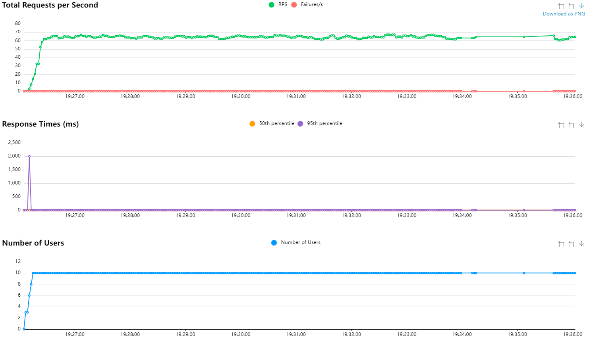

# ДЗ

Нужно расписать тесты для demo_service из лекции 4. Сдача на основе процента
покрытия кода тестами - требуется добиться 100% покрытия для получения 2-х
баллов (нужно доставить плагин `pytest`). Для проверки был добавлен step в CI.
Тесты для сервиса должны лежать в этой директории (`test/lecture_4/hw`).
Команда, для запуска тестов:

```sh
poetry run pytest \
    -vv \
    --cov=lecture_4/demo_service \
    ./tests/lecture_4/hw
```

Для получения 3-х баллов, помимо 100% покрытия нужно так же реализовать скрипт
для нагрузочного тестирования приложения (инструмент можно выбирать на
усмотрение). Длительность не менее 10 минут (а лучше больше), требуется
приложить в PR графики из Grafana с RPS и Success Rate (% успешных, то есть
200-х запросов), а так же отчет формируемый инструментом, если таковой есть.

## Реализация  

Запуск тестов выполнен локально с ипользованием команды  

```python
poetry run pytest -vv --strict --showlocals --cov=lecture_4/demo_service ./tests/lecture_4/hw/
```

Результат:  

```
tests/lecture_4/hw/test_hw_4.py::test_register_user2 PASSED                                                                                                                                                                                                                                         [  5%]
tests/lecture_4/hw/test_hw_4.py::test_register_user_name_exists PASSED                                                                                                                                                                                                                              [ 10%]
tests/lecture_4/hw/test_hw_4.py::test_register_user_name_bad_password PASSED                                                                                                                                                                                                                        [ 15%]
tests/lecture_4/hw/test_hw_4.py::test_register_user_invalid_data2 PASSED                                                                                                                                                                                                                            [ 21%]
tests/lecture_4/hw/test_hw_4.py::test_get_user_by_id2 PASSED                                                                                                                                                                                                                                        [ 26%]
tests/lecture_4/hw/test_hw_4.py::test_get_user_by_username2 PASSED                                                                                                                                                                                                                                  [ 31%]
tests/lecture_4/hw/test_hw_4.py::test_get_user_both_id_and_username2 PASSED                                                                                                                                                                                                                         [ 36%]
tests/lecture_4/hw/test_hw_4.py::test_get_user_neither_id_nor_username2 PASSED                                                                                                                                                                                                                      [ 42%]
tests/lecture_4/hw/test_hw_4.py::test_get_user_oher PASSED                                                                                                                                                                                                                                          [ 47%]
tests/lecture_4/hw/test_hw_4.py::test_user_promote PASSED                                                                                                                                                                                                                                           [ 52%]
tests/lecture_4/hw/test_hw_4.py::test_get_by_username_not_exists PASSED                                                                                                                                                                                                                             [ 57%] 
tests/lecture_4/hw/test_hw_4.py::test_user_grant_admin PASSED                                                                                                                                                                                                                                       [ 63%]
tests/lecture_4/hw/test_hw_4.py::test_from_user_entity PASSED                                                                                                                                                                                                                                       [ 68%] 
tests/lecture_4/hw/test_hw_4.py::test_user_role PASSED                                                                                                                                                                                                                                              [ 73%] 
tests/lecture_4/hw/test_hw_4.py::test_initialize PASSED                                                                                                                                                                                                                                             [ 78%] 
tests/lecture_4/hw/test_hw_4.py::test_user_service PASSED                                                                                                                                                                                                                                           [ 84%]
tests/lecture_4/hw/test_hw_4.py::test_requires_author_success PASSED                                                                                                                                                                                                                                [ 89%] 
tests/lecture_4/hw/test_hw_4.py::test_requires_admin_success PASSED                                                                                                                                                                                                                                 [ 94%] 
tests/lecture_4/hw/test_hw_4.py::test_requires_admin_forbidden PASSED                                                                                                                                                                                                                               [100%] 
tests/lecture_4/hw/test_hw_4.py::test_register_user2
  d:\ИТМО\2 курс\pytnon_backend\.venv\Lib\site-packages\tornado\ioloop.py:274: DeprecationWarning: There is no current event loop
    loop = asyncio.get_event_loop()

-- Docs: https://docs.pytest.org/en/stable/how-to/capture-warnings.html

---------- coverage: platform win32, python 3.13.0-final-0 -----------
Name                                      Stmts   Miss  Cover
-------------------------------------------------------------
lecture_4\demo_service\__init__.py            0      0   100%
lecture_4\demo_service\api\__init__.py        0      0   100%
lecture_4\demo_service\api\contracts.py      21      0   100%
lecture_4\demo_service\api\main.py            7      0   100%
lecture_4\demo_service\api\users.py          29      0   100%
lecture_4\demo_service\api\utils.py          32      0   100%
lecture_4\demo_service\core\__init__.py       0      0   100%
lecture_4\demo_service\core\users.py         48      0   100%
-------------------------------------------------------------
TOTAL                                       137      0   100%

```

Для выполнения нагрузочного тестирования взят locust. В качестве веб приложения - сервис ShopAPI из ДЗ2.  

  

Отчет в формате html находится [здесь](load_test_report/report_1729701545.3108826.html)